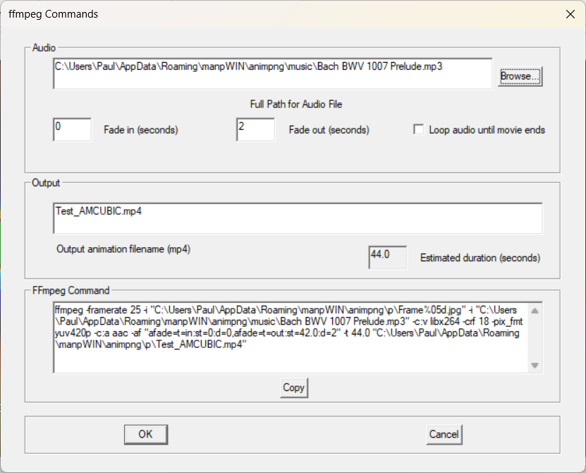

# Create FFmpeg Script

## Introduction

The Create FFmpeg Script function generates an FFmpeg command that converts the JPG frame sequence created by Prepare Frames into a high-quality MP4 movie.

The JPG sequence is determined automatically from the output created by Prepare Frames. The primary purpose of this dialog is to configure audio options and the output MP4 filename.

FFmpeg performs the final video encoding and produces the completed MP4 movie.

---

## Create FFmpeg Script Dialog

The Create FFmpeg Script dialog is shown below.



---

## Audio File

An optional audio track may be included in the movie.

Use the Browse button to select an audio file.

If no audio file is selected, a silent movie will be created.

---

## Fade In

Fade In specifies the number of seconds used to gradually increase the audio volume at the beginning of the movie.

This can provide a smoother introduction to the soundtrack.

---

## Fade Out

Fade Out specifies the number of seconds used to gradually decrease the audio volume at the end of the movie.

This can provide a smoother ending to the soundtrack.

---

## Loop Audio Until Movie Ends

If enabled, the selected audio track will repeat automatically until the movie has completed.

This is useful when the movie duration exceeds the length of the selected audio file.

---

## Output Animation Filename

ManpMovieMaker automatically generates an MP4 filename based on the source animation.

The generated filename can be modified if desired.

The completed movie will be written to the specified location.

---

## Estimated Duration

The estimated duration displays the expected length of the completed movie.

This value is calculated automatically from the generated JPG frame sequence and the selected frame rate.

The estimated duration is useful when selecting audio tracks and fade times.

---

## FFmpeg Command

The generated FFmpeg command is displayed in the lower section of the dialog.

Advanced users may review or modify the command if required.

Press the Copy button to copy the command to the clipboard.

The copied command can then be pasted into a command prompt window and executed.

Note that pressing OK simply closes the dialog. The FFmpeg command is not automatically copied to the clipboard.

---

## Output Frame Dimensions

ManpMovieMaker writes JPG frames that are intended to be assembled into an MP4 using FFmpeg.

When creating H.264 MP4 output with `yuv420p`, FFmpeg requires the frame width and height to be even numbers.

For best performance, prepare animations using image sizes with even width and height. If an odd frame dimension is used, ManpMovieMaker automatically crops the final image by one pixel as required before writing the JPG file.

This compatibility crop allows FFmpeg to encode the movie successfully, but it introduces a small amount of extra processing during JPG generation. In other words, ManpMovieMaker can correct odd dimensions automatically, but even dimensions remain the preferred choice.

For example:

- `1200 × 675` becomes `1200 × 674`
- `1281 × 720` becomes `1280 × 720`

---

## Generating the FFmpeg Command

After configuring the required settings:

1. Optionally select an audio file.
2. Configure fade in and fade out times if required.
3. Optionally enable audio looping.
4. Review the output MP4 filename.
5. Press Copy to copy the generated FFmpeg command to the clipboard.
6. Press OK to close the dialog.

---

## Running FFmpeg

Before using this feature, FFmpeg must be installed on your system.

See FFmpegInstallation.md for installation instructions.

Open a command prompt window.

Paste the copied FFmpeg command into the command prompt and press Enter.

FFmpeg will:

* Read the generated JPG frame sequence.
* Encode the video stream.
* Add the optional audio track.
* Apply fade in and fade out effects.
* Create the final MP4 movie.

Processing time depends on the number of frames, movie resolution and FFmpeg settings.

---

## Verifying the Results

When FFmpeg has completed:

* Confirm that the MP4 file has been created.
* Play the movie.
* Verify that video and audio are correct.
* Verify that fade in and fade out effects behave as expected.

The movie is now ready for viewing or distribution.

---

## Troubleshooting

### I Pressed OK But Nothing Happened

The OK button simply closes the dialog.

Press Copy before closing the dialog and then paste the generated FFmpeg command into a command prompt window.

### FFmpeg Is Not Recognised

FFmpeg is either not installed or is not accessible from the command prompt.

See FFmpegInstallation.md for installation instructions.

### No Audio Is Present

Verify that:

* An audio file was selected.
* The audio file exists.
* FFmpeg supports the selected audio format.

---

## Next Step

Enjoy your movie.

The typical workflow is:

```text
Render PNG images in ManpWIN
            ↓
Prepare Frames (S)
            ↓
Create FFmpeg Script (F)
            ↓
Copy FFmpeg Command
            ↓
Run FFmpeg
            ↓
MP4 Movie
```

For information about installing FFmpeg, see:

FFmpegInstallation.md
