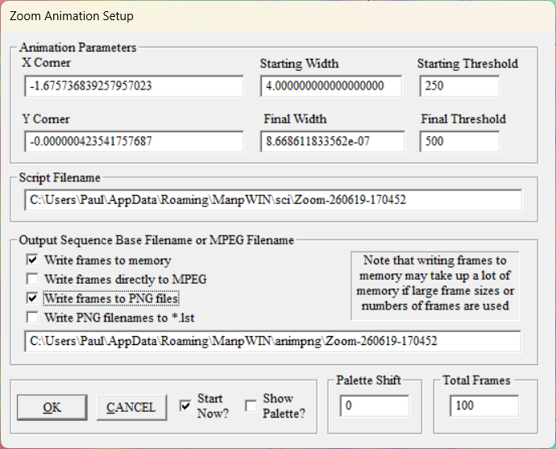

# Creating Animations in ManpWIN

## Introduction

ManpWIN can generate a variety of animation types, including:

* Zoom animations
* Julia animations
* Fourier animations
* Inversion animations
* Parameter animations
* 3D Oscillator, Fractal Map, Surface and Knot animations
* Morphing Oscillator animations

Any animation that produces a sequence of PNG images can be processed by ManpMovieMaker.

This document uses a zoom animation as an example because it is one of the most common animation types.

---

## Creating a Zoom Animation

Select:

Animation Generation → Setup Zoom Animation

The Zoom Animation Setup dialog is shown below.

---

## Important Settings

Only a few settings are required to create animations for use with ManpMovieMaker.

### Starting Width and Final Width

These values define the zoom range of the animation.

Smaller final widths produce deeper zooms.

---

## Output Frame Dimensions

ManpMovieMaker writes JPG frames that are intended to be assembled into an MP4 using FFmpeg.

When creating H.264 MP4 output with `yuv420p`, FFmpeg requires the frame width and height to be even numbers.

For best performance, prepare animations using image sizes with even width and height. If an odd frame dimension is used, ManpMovieMaker automatically crops the final image by one pixel as required before writing the JPG file.

This compatibility crop allows FFmpeg to encode the movie successfully, but it introduces a small amount of extra processing during JPG generation. In other words, ManpMovieMaker can correct odd dimensions automatically, but even dimensions remain the preferred choice.

For example:

- `1200 × 675` becomes `1200 × 674`
- `1281 × 720` becomes `1280 × 720`

---

### Total Frames

This specifies the number of source images that ManpWIN will render.

More frames generally produce smoother animations and reduce the amount of interpolation required by ManpMovieMaker.

### Write Frames to PNG Files

For use with ManpMovieMaker, PNG output should normally be enabled.

ManpMovieMaker uses the generated PNG sequence as its input.

---

## Choosing Threshold Values

The starting threshold controls the amount of detail calculated at the beginning of the animation.

For shallow zooms, the default value is often sufficient.

For deeper zooms, increasing the starting threshold may reveal significantly more fractal detail. If the starting threshold is too low, fine structures may not be fully resolved, particularly when the animation passes through minibrots or other regions containing complex detail.

The final threshold is automatically increased during the animation and is often already very large. In many cases, increasing the starting threshold provides better detail throughout the entire sequence.

---

## Memory Considerations

ManpWIN can store generated frames in memory rather than writing them immediately to disk.

This allows the completed animation to be played back immediately after rendering has finished, which can be convenient when creating shorter animations.

However, large animations, high resolutions, or long movie sequences can require substantial amounts of memory. A long animation at HD or 4K resolution may require many gigabytes of RAM if all frames are retained in memory.

For large projects it is usually preferable to write frames directly to PNG files rather than storing the entire animation in memory.

---

## Direct MPEG Output

ManpWIN includes the ability to create MPEG files directly.

While this can be useful for quick previews, the quality of the generated MPEG files is limited compared with modern video encoders.

For best results, it is recommended to generate PNG files and use ManpMovieMaker together with FFmpeg to create the final MP4 movie.

---

## Rendering the Animation

After configuring the animation parameters:

1. Select an output filename.
2. Enable PNG output.
3. Specify the number of frames.
4. Press OK.

ManpWIN will begin rendering the animation and writing PNG images to the selected output location.

Rendering time depends on:

* Image resolution
* Number of frames
* Fractal type
* Iteration thresholds
* Arithmetic precision

Large deep-zoom animations may require many hours or even days to complete.

---

## Verifying the PNG Sequence

When rendering has completed, verify that:

* PNG files have been created.
* The files are sequentially numbered.
* The expected number of frames has been generated.

These PNG files form the source sequence used by ManpMovieMaker.

---

## Next Step

Once the PNG sequence has been generated, proceed to:

PrepareFrames.md

This document explains how to create the intermediate JPG frames used to build the final movie.
