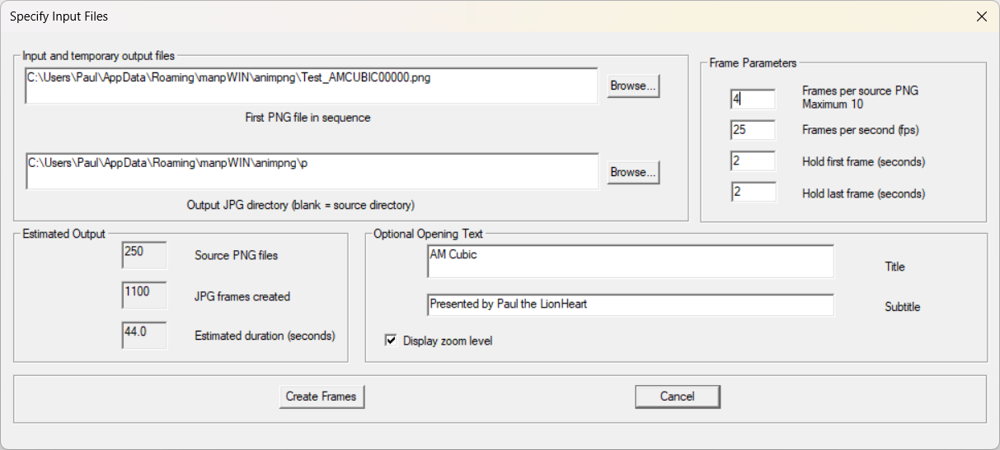

# Prepare Frames

## Introduction

The Prepare Frames function converts a sequence of PNG images into a sequence of JPG movie frames suitable for processing by FFmpeg.

ManpMovieMaker generates intermediate frames between rendered source images. When the source images form a zoom sequence, the intermediate frames are created by resizing and cropping. When the source images are not a zoom sequence, ManpMovieMaker creates morph frames between adjacent images.

Prepare Frames is normally the first stage of the ManpMovieMaker workflow.

---

## Prepare Frames Dialog

The Prepare Frames dialog is shown below.



---

## Output Frame Dimensions

ManpMovieMaker writes JPG frames that are intended to be assembled into an MP4 using FFmpeg.

When creating H.264 MP4 output with `yuv420p`, FFmpeg requires the frame width and height to be even numbers.

For best performance, prepare animations using image sizes with even width and height. If an odd frame dimension is used, ManpMovieMaker automatically crops the final image by one pixel as required before writing the JPG file.

This compatibility crop allows FFmpeg to encode the movie successfully, but it introduces a small amount of extra processing during JPG generation. In other words, ManpMovieMaker can correct odd dimensions automatically, but even dimensions remain the preferred choice.

For example:

- `1200 × 675` becomes `1200 × 674`
- `1281 × 720` becomes `1280 × 720`

---

## Selecting the PNG Sequence

The first PNG file identifies the source image sequence.

ManpMovieMaker examines the selected file and automatically determines the remaining files in the sequence.

The PNG images are typically generated by ManpWIN, although any compatible image sequence may be used.

---

## Choosing an Output Folder

The output folder specifies where the generated JPG frames will be written.

For larger projects it is recommended that PNG source images and JPG output frames be stored in separate folders.

A typical layout might be:

```text
PNG/
    <source PNG sequence>

JPG/
    Frame00001.jpg
    Frame00002.jpg
    Frame00003.jpg
    ...
```

The PNG filenames are determined by the source animation.

ManpMovieMaker generates a sequential JPG frame series suitable for processing by FFmpeg.

---

## Frames Per Second

Frames Per Second (FPS) controls the playback speed of the final movie.

Common values include:

* 24 FPS
* 25 FPS
* 30 FPS
* 60 FPS

Higher frame rates generally produce smoother motion but require more movie frames.

---

## Start and End Hold Times

Start Seconds and End Seconds allow the opening and closing frames of the animation to remain visible for a specified period.

This can be useful when displaying opening titles, fractal names, zoom information, or closing frames.

The specified time is automatically converted into the required number of movie frames.

---

## Inserted Frames

Inserted Frames controls the number of intermediate frames generated between adjacent PNG images.

For example:

```text
0 inserted frames
    PNG1 -> PNG2

3 inserted frames
    PNG1 -> I1 -> I2 -> I3 -> PNG2
```

For zoom animations, inserted frames are created by resizing and cropping.

For non-zoom animations, inserted frames are created by morphing between adjacent images.

Typical values are:

* 3 inserted frames
* 4 inserted frames

Larger values may further reduce rendering requirements but can gradually reduce image quality.

## Zoom Text Overlay

If zoom text is enabled, ManpMovieMaker overlays the current zoom value onto zoom-animation frames at regular intervals during frame generation.

The zoom text is drawn directly onto the generated JPG frames, so it becomes part of the final animation and does not require any additional processing in FFmpeg.

---

## Opening Text and Subtext

Opening Text and Opening Subtext can be used to add introductory titles to the movie.

Opening Text is typically used for the movie title.

Opening Subtext can be used for additional information such as fractal type, colouring method, rendering details, or author information.

These titles are rendered directly into the generated JPG frames.

---

## Zoom Display

For zoom animations, ManpMovieMaker can optionally display the current zoom magnification during the movie.

The displayed zoom is calculated automatically from the source image sequence.

Zoom display is only available when a zoom progression exists between the source images. For non-zoom animations, zoom information is not displayed.

---

## Creating the JPG Sequence

After configuring the required settings:

1. Select the source PNG sequence.
2. Select an output folder.
3. Specify the desired frame rate.
4. Specify the number of inserted frames.
5. Optionally configure titles and zoom display.
6. Press Create Frames.

ManpMovieMaker will generate the completed JPG sequence.

---

## Verifying the Results

When processing has completed, verify that:

* JPG files have been created.
* The sequence numbering is continuous.
* The expected number of frames has been generated.

The generated sequence is now ready for movie creation.

---

## Next Step

> **Tip**  
> For best compatibility with FFmpeg and H.264 MP4 output, use image sizes with even width and height. If an odd dimension is used, ManpMovieMaker will automatically crop the frame to the nearest valid size.

Proceed to:

CreateFFmpegScript.md

This document explains how to generate an FFmpeg script and create the final MP4 movie.
